In this notebook we analyse the CMDs and stellar distribution in the r band of
the stars in pointing A763. This pointing is expected to probe the Gemini
RRLyrae stream based on its position. Thus we are looking for an overdensity at
the right distance ($R_{GC}\approx70$ kpc, which means $R_{helio}\approx70$
kpc).

## Load libraries:

    %matplotlib inline
    import numpy as np
    #import asciidata as asd
    
    import matplotlib.pyplot as plt
    from matplotlib.font_manager import FontProperties
    fontP = FontProperties()
    fontP.set_size('small')

    /usr/lib64/python2.7/site-packages/matplotlib/__init__.py:758: UserWarning: Found matplotlib configuration in ~/.matplotlib/. To conform with the XDG base directory standard, this configuration location has been deprecated on Linux, and the new location is now '/home/piladiez/.config'/matplotlib/. Please move your configuration there to ensure that matplotlib will continue to find it in the future.
      _get_xdg_config_dir())

    from scipy.stats import kde

    from lib_frange import frange

## Load the data file and organize its columns into vectors:

    cat='/disks/shear7/piladiez/KiDS/catalogues/gaap_data/KIDS_135.0_0.5_ugri_stars.col'
    ra,dec,r,gr=np.loadtxt(cat,usecols=[0,1,19,22],unpack=True) # 20,23
    
    # Clean subset within expected colour values (no cosmic rays, etc.)
    use_r = np.where((r>16) & (r<25.0))
    ra = ra[use_r]
    dec = dec[use_r]
    r = r[use_r]
    gr = gr[use_r]
    use_gr = np.where((gr>-0.5) & (gr<2.5))
    ra = ra[use_gr]
    dec = dec[use_gr]
    r = r[use_gr]
    gr = gr[use_gr]

    catMS='/disks/shear7/piladiez/KiDS/catalogues/gaap_data/nearMSTOstars_KIDS_135.0_0.5_.cat'
    raMS,decMS,rMS,grMS=np.loadtxt(catMS,usecols=[0,1,19,22],unpack=True) # 20,23
    
    # Clean subset within expected colour values (no cosmic rays, etc.)
    use_r = np.where((rMS>16) & (rMS<25.0))
    raMS = raMS[use_r]
    decMS = decMS[use_r]
    rMS = rMS[use_r]
    grMS = grMS[use_r]
    use_gr = np.where((grMS>-0.5) & (grMS<2.5))
    raMS = raMS[use_gr]
    decMS = decMS[use_gr]
    rMS = rMS[use_gr]
    grMS = grMS[use_gr]

    catRC='/disks/shear7/piladiez/KiDS/catalogues/gaap_data/RedClumpstars_KIDS_135.0_0.5_.cat'
    raRC,decRC,rRC,grRC=np.loadtxt(catRC,usecols=[0,1,19,22],unpack=True) # 20,23
    
    # Clean subset within expected colour values (no cosmic rays, etc.)
    use_r = np.where((rRC>16) & (rRC<25.0))
    raRC = raRC[use_r]
    decRC = decRC[use_r]
    rRC = rRC[use_r]
    grRC = grRC[use_r]
    use_gr = np.where((grRC>-0.5) & (grRC<2.5))
    raRC = raRC[use_gr]
    decRC = decRC[use_gr]
    rRC = rRC[use_gr]
    grRC = grRC[use_gr]

    import matplotlib
    fontP.set_size('xx-small')
    
    from matplotlib.colors import LogNorm

## Generic stellar spatial maps

* Scatter plot, all point-like sources:

    plt.figure(num=1)#, figsize=(10,10))
    plt.tick_params(labelsize=16) 
    #plt.title('$\chi^2_{red}$ map for $n$ and $q$')
    plt.title('All stars, map')
    
    plt.xlabel('RA (deg)', fontsize=14)
    plt.ylabel('Dec (deg)', fontsize=14)
    
    #plt.ylim((25,16))
    
    plt.plot(ra,dec,'.k',ms=1)

    [<matplotlib.lines.Line2D at 0x7f8da17843d0>]

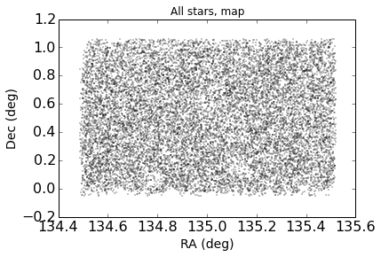

* Halo stars (0.2<g-r<0.3):

    use_gr = np.where((gr>=0.2) & (gr<=0.3))
    raHalo = ra[use_gr]
    decHalo = dec[use_gr]
    rHalo = r[use_gr]
    grHalo = gr[use_gr]
    use_gr = np.where((rHalo<=23.0) & (rHalo>=20.0))
    raHalo = raHalo[use_gr]
    decHalo = decHalo[use_gr]
    rHalo = rHalo[use_gr]
    grHalo = grHalo[use_gr]

    plt.figure(num=2)#, figsize=(10,10))
    plt.tick_params(labelsize=16) 
    #plt.title('$\chi^2_{red}$ map for $n$ and $q$')
    plt.title('Halo faint stars, map (0.2<g-r<0.3, r>20.0)')
    
    plt.xlabel('RA (deg)', fontsize=14)
    plt.ylabel('Dec (deg)', fontsize=14)
    
    #plt.ylim((25,16))
    
    plt.plot(ra,dec,'.k',ms=1)

    [<matplotlib.lines.Line2D at 0x7f8d9e9c3650>]

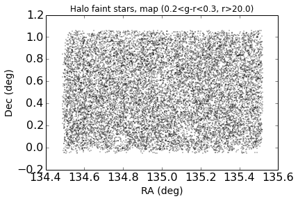

## Generic Colour-Magnitude Diagrams:

* Scatter plot (black are all the point-like sources, blue are the RC stars, red
is the subset of RC stars that looked promising):

    plt.figure(num=3, figsize=(10,8))
    plt.tick_params(labelsize=16) 
    #plt.title('$\chi^2_{red}$ map for $n$ and $q$')
    
    
    plt.xlabel('g-r', fontsize=14)
    plt.ylabel('r (mag)', fontsize=14)
    
    plt.ylim((25,16))
    #plt.ylim((23,19))
    #plt.xlim((0,1))
    
    plt.plot(gr,r,'.k',ms=2)
    plt.plot(grRC,rRC,'.b',ms=2)
    plt.plot(grRC_clump,rRC_clump,'.r',ms=2)
    #plt.plot(grF,rF,'.r',ms=1)

    [<matplotlib.lines.Line2D at 0x7f8d8f7f4410>]

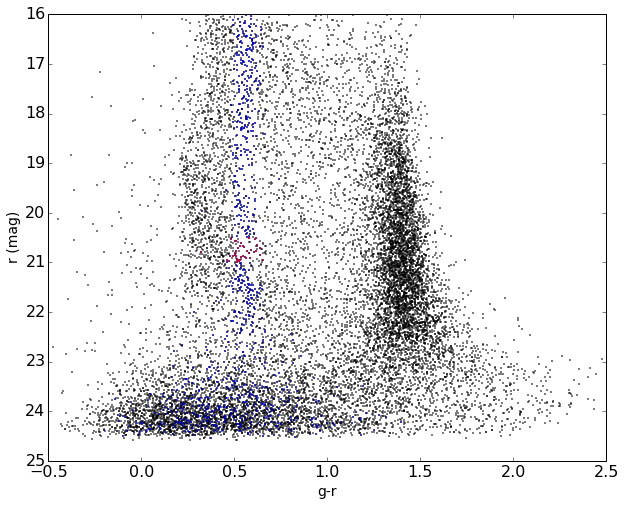

    use_rclump = np.where((rRC>=20.5) & (rRC<=21.0))
    raRC_clump = raRC[use_rclump]
    decRC_clump = decRC[use_rclump]
    rRC_clump = rRC[use_rclump]
    grRC_clump = grRC[use_rclump]

    plt.figure(num=2, figsize=(12,4))
    plt.tick_params(labelsize=16) 
    #plt.title('$\chi^2_{red}$ map for $n$ and $q$')
    plt.suptitle('Red clump, map')
    
    plt.subplot(121)
    plt.xlabel('RA (deg)', fontsize=14)
    plt.ylabel('Dec (deg)', fontsize=14)
    plt.ylim((-0.2,1.2))
    plt.plot(raRC,decRC,'.r',ms=2)
    plt.gca().invert_xaxis()
    
    plt.subplot(122)
    plt.xlabel('RA (deg)', fontsize=14)
    plt.ylabel('Dec (deg)', fontsize=14)
    #plt.ylim((25,16))
    plt.ylim((-0.2,1.2))
    plt.plot(raRC_clump,decRC_clump,'.r',ms=2)
    plt.gca().invert_xaxis()

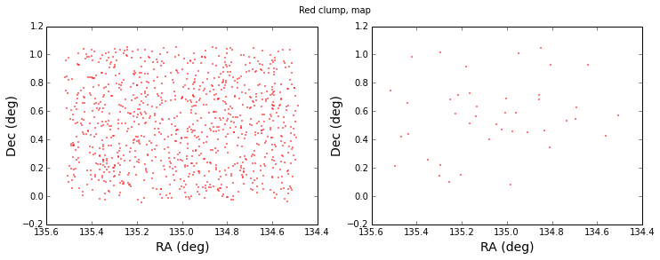

    use_gr = np.where((gr>=0.0) & (gr<=1.0))
    raLoose = ra[use_gr]
    decLoose = dec[use_gr]
    rLoose = r[use_gr]
    grLoose = gr[use_gr]
    use_gr = np.where((rLoose<=23.0))
    raLoose = raLoose[use_gr]
    decLoose = decLoose[use_gr]
    rLoose = rLoose[use_gr]
    grLoose = grLoose[use_gr]

    nbins=200
    
    plt.figure(num=4, figsize=(10,8))
    plt.tick_params(labelsize=16) 
    #plt.title('$\chi^2_{red}$ map for $n$ and $q$')
    
    plt.xlabel('g-r', fontsize=14)
    plt.ylabel('r (mag)', fontsize=14)
    
    #plt.xlim(-0.4,1.6)
    plt.ylim((23,16.))
    
    # Evaluate a gaussian kde on a regular grid of nbins x nbins over data extents
    gr_kde=np.reshape(grLoose,(len(grLoose),1))
    r_kde=np.reshape(rLoose,(len(rLoose),1))
    data=np.hstack((gr_kde,r_kde))
    
    
    k = kde.gaussian_kde(data.T,bw_method=0.1)  # 'scott' (default), 'silverman'
    xi, yi = np.mgrid[gr_kde.min():gr_kde.max():nbins*1j, r_kde.min():r_kde.max():nbins*1j]
    zi = k(np.vstack([xi.flatten(), yi.flatten()]))
    
    #plt.set_title('Gaussian KDE')
    plt.pcolormesh(xi, yi, zi.reshape(xi.shape))
    plt.colorbar()
    
    plt.show()

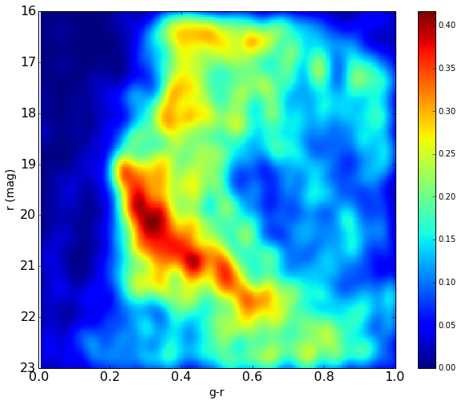

    nbins=200
    
    plt.figure(num=4, figsize=(10,8))
    plt.tick_params(labelsize=16) 
    #plt.title('$\chi^2_{red}$ map for $n$ and $q$')
    
    plt.xlabel('g-r', fontsize=14)
    plt.ylabel('r (mag)', fontsize=14)
    
    #plt.xlim(-0.4,1.6)
    plt.ylim((23,16.))
    
    # Evaluate a gaussian kde on a regular grid of nbins x nbins over data extents
    gr_kde=np.reshape(grLoose,(len(grLoose),1))
    r_kde=np.reshape(rLoose,(len(rLoose),1))
    data=np.hstack((gr_kde,r_kde))
    
    
    k = kde.gaussian_kde(data.T,bw_method=0.06)  # 'scott' (default), 'silverman'
    xi, yi = np.mgrid[gr_kde.min():gr_kde.max():nbins*1j, r_kde.min():r_kde.max():nbins*1j]
    zi = k(np.vstack([xi.flatten(), yi.flatten()]))
    
    #plt.set_title('Gaussian KDE')
    plt.pcolormesh(xi, yi, zi.reshape(xi.shape))
    plt.colorbar()
    
    plt.show()

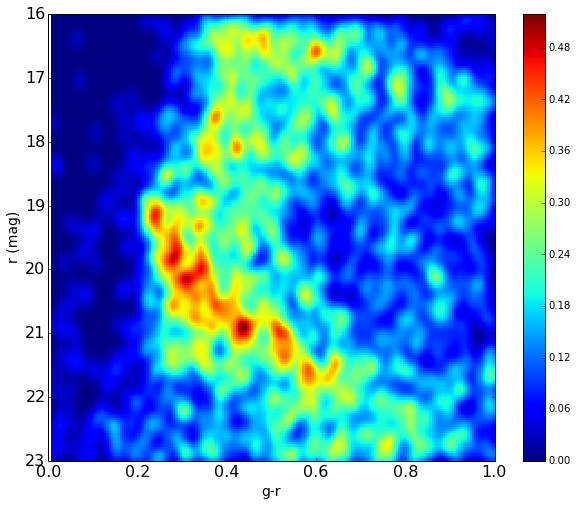

## Digging the spatial overdensities out of the CMD:

Based on the main sequence on the CMD, I select (g-r,r) small regions and plot
them in (RA,Dec) in order to identify overdensities:

* __0.2<g-r<0.35, 19.0<r<20.0:__

    use_gr = np.where((gr>=0.2) & (gr<=0.35))
    raDens0 = ra[use_gr]
    decDens0 = dec[use_gr]
    rDens0 = r[use_gr]
    grDens0 = gr[use_gr]
    use_gr = np.where((rDens0<=20.0) & (rDens0>=19.0))
    raDens0 = raDens0[use_gr]
    decDens0 = decDens0[use_gr]
    rDens0 = rDens0[use_gr]
    grDens0 = grDens0[use_gr]
    
    plt.figure(num=5)#, figsize=(12,4))
    plt.tick_params(labelsize=16) 
    #plt.title('$\chi^2_{red}$ map for $n$ and $q$')
    plt.suptitle('Main sequence density (0.2<g-r<0.35, 19.0<r<20.0)')
    
    plt.xlabel('RA (deg)', fontsize=14)
    plt.ylabel('Dec (deg)', fontsize=14)
    plt.ylim((-0.2,1.2))
    #plt.ylim((25,16))
    plt.plot(raDens0,decDens0,'.r',ms=2)
    plt.gca().invert_xaxis()

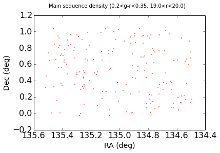

    nbins=100
    
    plt.figure(num=6)#, figsize=(5,4))
    plt.tick_params(labelsize=12) 
    #plt.title('$\chi^2_{red}$ map for $n$ and $q$')
    
    plt.xlabel('ra', fontsize=14)
    plt.ylabel('dec', fontsize=14)
    
    #plt.xlim(-0.4,1.6)
    #plt.ylim((23,16.))
    
    # Evaluate a gaussian kde on a regular grid of nbins x nbins over data extents
    ra_kde=np.reshape(raDens0,(len(raDens0),1))
    dec_kde=np.reshape(decDens0,(len(decDens0),1))
    data=np.hstack((ra_kde,dec_kde))
    
    
    k = kde.gaussian_kde(data.T,bw_method=0.1)  # 'scott' (default), 'silverman'
    xi, yi = np.mgrid[ra_kde.min():ra_kde.max():nbins*1j, dec_kde.min():dec_kde.max():nbins*1j]
    zi = k(np.vstack([xi.flatten(), yi.flatten()]))
    plt.gca().invert_xaxis()
    plt.ylim((-0.2,1.2))
    
    #plt.set_title('Gaussian KDE')
    plt.pcolormesh(xi, yi, zi.reshape(xi.shape))
    plt.colorbar()
    
    plt.show()

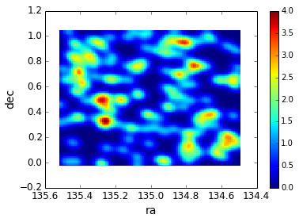

* __0.25<g-r<0.35, 20.0<r<21.0:__

    use_gr = np.where((gr>=0.25) & (gr<=0.35))
    raDens = ra[use_gr]
    decDens = dec[use_gr]
    rDens = r[use_gr]
    grDens = gr[use_gr]
    use_gr = np.where((rDens<=21.0) & (rDens>=20.0))
    raDens = raDens[use_gr]
    decDens = decDens[use_gr]
    rDens = rDens[use_gr]
    grDens = grDens[use_gr]
    
    plt.figure(num=5)#, figsize=(12,4))
    plt.tick_params(labelsize=16) 
    #plt.title('$\chi^2_{red}$ map for $n$ and $q$')
    plt.suptitle('Main sequence density (0.25<g-r<0.35, 19.8<r<20.8)')
    
    plt.xlabel('RA (deg)', fontsize=14)
    plt.ylabel('Dec (deg)', fontsize=14)
    plt.ylim((-0.2,1.2))
    #plt.ylim((25,16))
    plt.plot(raDens,decDens,'.r',ms=2)
    plt.gca().invert_xaxis()

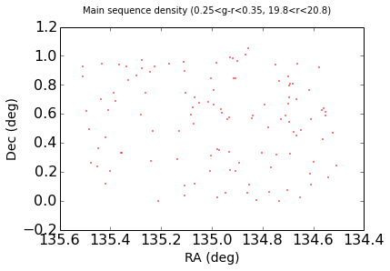

    nbins=100
    
    plt.figure(num=6)#, figsize=(5,4))
    plt.tick_params(labelsize=12) 
    #plt.title('$\chi^2_{red}$ map for $n$ and $q$')
    
    plt.xlabel('ra', fontsize=14)
    plt.ylabel('dec', fontsize=14)
    
    #plt.xlim(-0.4,1.6)
    #plt.ylim((23,16.))
    
    # Evaluate a gaussian kde on a regular grid of nbins x nbins over data extents
    ra_kde=np.reshape(raDens,(len(raDens),1))
    dec_kde=np.reshape(decDens,(len(decDens),1))
    data=np.hstack((ra_kde,dec_kde))
    
    
    k = kde.gaussian_kde(data.T,bw_method=0.1)  # 'scott' (default), 'silverman'
    xi, yi = np.mgrid[ra_kde.min():ra_kde.max():nbins*1j, dec_kde.min():dec_kde.max():nbins*1j]
    zi = k(np.vstack([xi.flatten(), yi.flatten()]))
    plt.gca().invert_xaxis()
    plt.ylim((-0.2,1.2))
    
    #plt.set_title('Gaussian KDE')
    plt.pcolormesh(xi, yi, zi.reshape(xi.shape))
    plt.colorbar()
    
    plt.show()

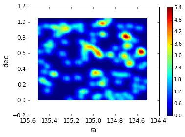

* __0.37<g-r<0.46, 20.7<r<21.4:__

    use_gr = np.where((gr>=0.37) & (gr<=0.46))
    raDens2 = ra[use_gr]
    decDens2 = dec[use_gr]
    rDens2 = r[use_gr]
    grDens2 = gr[use_gr]
    use_gr = np.where((rDens2<=21.4) & (rDens2>=20.7))
    raDens2 = raDens2[use_gr]
    decDens2 = decDens2[use_gr]
    rDens2 = rDens2[use_gr]
    grDens2 = grDens2[use_gr]
    
    plt.figure(num=5)#, figsize=(12,4))
    plt.tick_params(labelsize=16) 
    #plt.title('$\chi^2_{red}$ map for $n$ and $q$')
    plt.suptitle('Main sequence density (0.37<g-r<0.46, 20.7<r<21.4)')
    
    plt.xlabel('RA (deg)', fontsize=14)
    plt.ylabel('Dec (deg)', fontsize=14)
    plt.ylim((-0.2,1.2))
    #plt.ylim((25,16))
    plt.plot(raDens2,decDens2,'.r',ms=2)
    plt.gca().invert_xaxis()

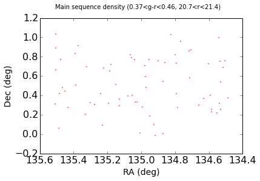

    nbins=100
    
    plt.figure(num=6)#, figsize=(5,4))
    plt.tick_params(labelsize=12) 
    #plt.title('$\chi^2_{red}$ map for $n$ and $q$')
    
    plt.xlabel('ra', fontsize=14)
    plt.ylabel('dec', fontsize=14)
    
    #plt.xlim(-0.4,1.6)
    #plt.ylim((23,16.))
    
    # Evaluate a gaussian kde on a regular grid of nbins x nbins over data extents
    ra_kde=np.reshape(raDens2,(len(raDens2),1))
    dec_kde=np.reshape(decDens2,(len(decDens2),1))
    data=np.hstack((ra_kde,dec_kde))
    
    
    k = kde.gaussian_kde(data.T,bw_method=0.1)  # 'scott' (default), 'silverman'
    xi, yi = np.mgrid[ra_kde.min():ra_kde.max():nbins*1j, dec_kde.min():dec_kde.max():nbins*1j]
    zi = k(np.vstack([xi.flatten(), yi.flatten()]))
    plt.gca().invert_xaxis()
    plt.ylim((-0.2,1.2))
    
    #plt.set_title('Gaussian KDE')
    plt.pcolormesh(xi, yi, zi.reshape(xi.shape))
    plt.colorbar()
    
    plt.show()

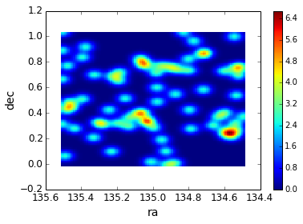

* __0.48<g-r<0.55, 21.0<r<21.6:__

    use_gr = np.where((gr>=0.48) & (gr<=0.55))
    raDens3 = ra[use_gr]
    decDens3 = dec[use_gr]
    rDens3 = r[use_gr]
    grDens3 = gr[use_gr]
    use_gr = np.where((rDens3<=21.6) & (rDens3>=21.0))
    raDens3 = raDens3[use_gr]
    decDens3 = decDens3[use_gr]
    rDens3 = rDens3[use_gr]
    grDens3 = grDens3[use_gr]
    
    plt.figure(num=5)#, figsize=(12,4))
    plt.tick_params(labelsize=16) 
    #plt.title('$\chi^2_{red}$ map for $n$ and $q$')
    plt.suptitle('Main sequence density (0.48<g-r<0.55, 21.6<r<21.0)')
    
    plt.xlabel('RA (deg)', fontsize=14)
    plt.ylabel('Dec (deg)', fontsize=14)
    plt.ylim((-0.2,1.2))
    #plt.ylim((25,16))
    plt.plot(raDens3,decDens3,'.r',ms=2)
    plt.gca().invert_xaxis()

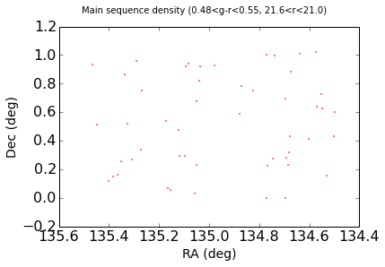

    nbins=100
    
    plt.figure(num=7)#, figsize=(5,4))
    plt.tick_params(labelsize=12) 
    #plt.title('$\chi^2_{red}$ map for $n$ and $q$')
    
    plt.xlabel('ra', fontsize=14)
    plt.ylabel('dec', fontsize=14)
    
    #plt.xlim(-0.4,1.6)
    #plt.ylim((23,16.))
    
    # Evaluate a gaussian kde on a regular grid of nbins x nbins over data extents
    ra_kde=np.reshape(raDens3,(len(raDens3),1))
    dec_kde=np.reshape(decDens3,(len(decDens3),1))
    data=np.hstack((ra_kde,dec_kde))
    
    
    k = kde.gaussian_kde(data.T,bw_method=0.1)  # 'scott' (default), 'silverman'
    xi, yi = np.mgrid[ra_kde.min():ra_kde.max():nbins*1j, dec_kde.min():dec_kde.max():nbins*1j]
    zi = k(np.vstack([xi.flatten(), yi.flatten()]))
    plt.gca().invert_xaxis()
    plt.ylim((-0.2,1.2))
    
    #plt.set_title('Gaussian KDE')
    plt.pcolormesh(xi, yi, zi.reshape(xi.shape))
    plt.colorbar()
    
    plt.show()

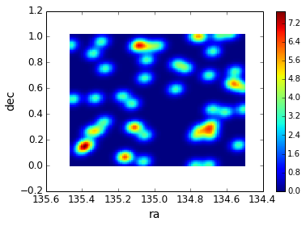

* __Combination of the above__:

    raComb = np.concatenate((raDens0,raDens,raDens2,raDens3),axis=0)
    decComb = np.concatenate((decDens0,decDens,decDens2,decDens3),axis=0)
    
    raComb = np.concatenate((raDens,raDens2,raDens3),axis=0)
    decComb = np.concatenate((decDens,decDens2,decDens3),axis=0)
    
    plt.figure(num=5)#, figsize=(12,4))
    plt.tick_params(labelsize=16) 
    #plt.title('$\chi^2_{red}$ map for $n$ and $q$')
    plt.suptitle('Main sequence density (combination of the above)')
    
    plt.xlabel('RA (deg)', fontsize=14)
    plt.ylabel('Dec (deg)', fontsize=14)
    plt.ylim((-0.2,1.2))
    #plt.ylim((25,16))
    plt.plot(raComb,decComb,'.r',ms=2)
    plt.gca().invert_xaxis()
    
    
    #########################################################3
    
    nbins=100
    
    plt.figure(num=7)#, figsize=(5,4))
    plt.tick_params(labelsize=12) 
    #plt.title('$\chi^2_{red}$ map for $n$ and $q$')
    
    plt.xlabel('ra', fontsize=14)
    plt.ylabel('dec', fontsize=14)
    
    #plt.xlim(-0.4,1.6)
    #plt.ylim((23,16.))
    
    # Evaluate a gaussian kde on a regular grid of nbins x nbins over data extents
    ra_kde=np.reshape(raComb,(len(raComb),1))
    dec_kde=np.reshape(decComb,(len(decComb),1))
    data=np.hstack((ra_kde,dec_kde))
    
    
    k = kde.gaussian_kde(data.T,bw_method=0.1)  # 'scott' (default), 'silverman'
    xi, yi = np.mgrid[ra_kde.min():ra_kde.max():nbins*1j, dec_kde.min():dec_kde.max():nbins*1j]
    zi = k(np.vstack([xi.flatten(), yi.flatten()]))
    plt.gca().invert_xaxis()
    plt.ylim((-0.2,1.2))
    
    #plt.set_title('Gaussian KDE')
    plt.pcolormesh(xi, yi, zi.reshape(xi.shape))
    plt.colorbar()
    
    plt.show()

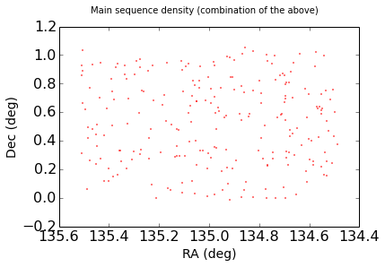

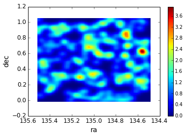

From the above map it seems that the densest regions are the two blobs centered
at RA,Dec = (134.55,0.65)deg and (134.70,0.85)deg.

## Target regions:

* __Right blob:__

    use_ra = np.where((ra>134.65) & (ra<134.75))
    raZoom = ra[use_ra]
    decZoom = dec[use_ra]
    rZoom = r[use_ra]
    grZoom = gr[use_ra]
    use_dec = np.where((decZoom>=0.75) & (decZoom<=0.9))
    raZoom = raZoom[use_dec]
    decZoom = decZoom[use_dec]
    rZoom = rZoom[use_dec]
    grZoom = grZoom[use_dec]
    
    plt.figure(num=4)#, figsize=(10,10))
    plt.tick_params(labelsize=16) 
    #plt.title('$\chi^2_{red}$ map for $n$ and $q$')
    
    
    plt.xlabel('g-r', fontsize=14)
    plt.ylabel('r (mag)', fontsize=14)
    
    plt.ylim((25,16))
    #plt.plot(gr,r,'.k',ms=2)
    plt.plot(grZoom,rZoom,'.k',ms=2)
    #plt.plot(grF,rF,'.r',ms=1)
    
    ###############################################################
    
    nbins=200
    plt.figure(num=4)
    plt.tick_params(labelsize=16) 
    #plt.title('$\chi^2_{red}$ map for $n$ and $q$')
    
    plt.xlabel('g-r', fontsize=14)
    plt.ylabel('r (mag)', fontsize=14)
    
    #plt.xlim(-0.4,1.6)
    
    
    # Evaluate a gaussian kde on a regular grid of nbins x nbins over data extents
    gr_kde=np.reshape(grZoom,(len(grZoom),1))
    r_kde=np.reshape(rZoom,(len(rZoom),1))
    data=np.hstack((gr_kde,r_kde))
    
    
    k = kde.gaussian_kde(data.T,bw_method=0.1)  # 'scott' (default), 'silverman'
    xi, yi = np.mgrid[gr_kde.min():gr_kde.max():nbins*1j, r_kde.min():r_kde.max():nbins*1j]
    zi = k(np.vstack([xi.flatten(), yi.flatten()]))
    
    #plt.set_title('Gaussian KDE')
    plt.pcolormesh(xi, yi, zi.reshape(xi.shape))
    plt.colorbar()
    
    plt.show()

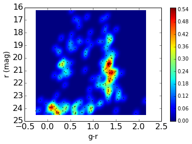

* __Left blob:__

    use_ra = np.where((ra>134.45) & (ra<134.6))
    raZoom = ra[use_ra]
    decZoom = dec[use_ra]
    rZoom = r[use_ra]
    grZoom = gr[use_ra]
    use_dec = np.where((decZoom>=0.58) & (decZoom<=0.68))
    raZoom = raZoom[use_dec]
    decZoom = decZoom[use_dec]
    rZoom = rZoom[use_dec]
    grZoom = grZoom[use_dec]
    
    plt.figure(num=4)#, figsize=(10,10))
    plt.tick_params(labelsize=16) 
    #plt.title('$\chi^2_{red}$ map for $n$ and $q$')
    
    
    plt.xlabel('g-r', fontsize=14)
    plt.ylabel('r (mag)', fontsize=14)
    
    plt.ylim((25,16))
    #plt.plot(gr,r,'.k',ms=2)
    plt.plot(grZoom,rZoom,'.k',ms=2)
    
    
    ###############################################################
    
    nbins=200
    plt.figure(num=4)
    plt.tick_params(labelsize=16) 
    #plt.title('$\chi^2_{red}$ map for $n$ and $q$')
    
    plt.xlabel('g-r', fontsize=14)
    plt.ylabel('r (mag)', fontsize=14)
    
    #plt.xlim(-0.4,1.6)
    
    
    # Evaluate a gaussian kde on a regular grid of nbins x nbins over data extents
    gr_kde=np.reshape(grZoom,(len(grZoom),1))
    r_kde=np.reshape(rZoom,(len(rZoom),1))
    data=np.hstack((gr_kde,r_kde))
    
    
    k = kde.gaussian_kde(data.T,bw_method=0.1)  # 'scott' (default), 'silverman'
    xi, yi = np.mgrid[gr_kde.min():gr_kde.max():nbins*1j, r_kde.min():r_kde.max():nbins*1j]
    zi = k(np.vstack([xi.flatten(), yi.flatten()]))
    
    #plt.set_title('Gaussian KDE')
    plt.pcolormesh(xi, yi, zi.reshape(xi.shape))
    plt.colorbar()
    
    plt.show()

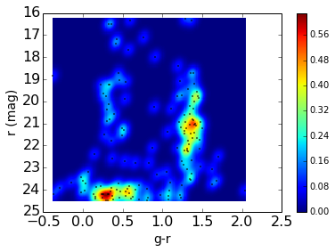

* __String at around (RA,Dec)=(135.0,0.6) deg:__

    use_ra = np.where((ra>134.8) & (ra<135.1))
    raZoom = ra[use_ra]
    decZoom = dec[use_ra]
    rZoom = r[use_ra]
    grZoom = gr[use_ra]
    use_dec = np.where((decZoom>=0.55) & (decZoom<=0.85))
    raZoom = raZoom[use_dec]
    decZoom = decZoom[use_dec]
    rZoom = rZoom[use_dec]
    grZoom = grZoom[use_dec]
    use_dec = np.where((decZoom>=0.55) & (decZoom<=0.70))
    raZoom2 = raZoom[use_dec]
    decZoom2 = decZoom[use_dec]
    rZoom2 = rZoom[use_dec]
    grZoom2= grZoom[use_dec]
    
    plt.figure(num=4)#, figsize=(10,10))
    plt.tick_params(labelsize=16) 
    #plt.title('$\chi^2_{red}$ map for $n$ and $q$')
    
    
    plt.xlabel('g-r', fontsize=14)
    plt.ylabel('r (mag)', fontsize=14)
    
    plt.ylim((25,16))
    #plt.plot(gr,r,'.k',ms=2)
    #plt.plot(grZoom2,rZoom2,'.w',ms=2)
    plt.plot(grZoom,rZoom,'.k',ms=2)
    
    ###############################################################
    
    nbins=200
    plt.figure(num=4)
    plt.tick_params(labelsize=16) 
    #plt.title('$\chi^2_{red}$ map for $n$ and $q$')
    
    plt.xlabel('g-r', fontsize=14)
    plt.ylabel('r (mag)', fontsize=14)
    
    #plt.xlim(-0.4,1.6)
    
    
    # Evaluate a gaussian kde on a regular grid of nbins x nbins over data extents
    gr_kde=np.reshape(grZoom,(len(grZoom),1))
    r_kde=np.reshape(rZoom,(len(rZoom),1))
    data=np.hstack((gr_kde,r_kde))
    
    
    k = kde.gaussian_kde(data.T,bw_method=0.1)  # 'scott' (default), 'silverman'
    xi, yi = np.mgrid[gr_kde.min():gr_kde.max():nbins*1j, r_kde.min():r_kde.max():nbins*1j]
    zi = k(np.vstack([xi.flatten(), yi.flatten()]))
    
    #plt.set_title('Gaussian KDE')
    plt.pcolormesh(xi, yi, zi.reshape(xi.shape))
    plt.colorbar()
    
    plt.show()

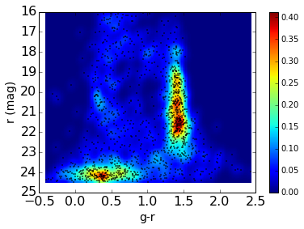

* __Parallel region at the bottom of the tile (0.0<=Dec<=0.15):__

    use_ra = np.where((ra>134.8) & (ra<135.1))
    raZoom = ra[use_ra]
    decZoom = dec[use_ra]
    rZoom = r[use_ra]
    grZoom = gr[use_ra]
    use_dec = np.where((decZoom>=0.0) & (decZoom<=0.15))
    raZoom = raZoom[use_dec]
    decZoom = decZoom[use_dec]
    rZoom = rZoom[use_dec]
    grZoom = grZoom[use_dec]
    
    plt.figure(num=4)#, figsize=(10,10))
    plt.tick_params(labelsize=16) 
    #plt.title('$\chi^2_{red}$ map for $n$ and $q$')
    
    
    plt.xlabel('g-r', fontsize=14)
    plt.ylabel('r (mag)', fontsize=14)
    
    plt.ylim((25,16))
    #plt.plot(gr,r,'.k',ms=2)
    plt.plot(grZoom,rZoom,'.k',ms=2)
    #plt.plot(grF,rF,'.r',ms=1)
    
    
    
    ###############################################################
    
    nbins=200
    plt.figure(num=4)
    plt.tick_params(labelsize=16) 
    #plt.title('$\chi^2_{red}$ map for $n$ and $q$')
    
    plt.xlabel('g-r', fontsize=14)
    plt.ylabel('r (mag)', fontsize=14)
    
    #plt.xlim(-0.4,1.6)
    
    
    # Evaluate a gaussian kde on a regular grid of nbins x nbins over data extents
    gr_kde=np.reshape(grZoom,(len(grZoom),1))
    r_kde=np.reshape(rZoom,(len(rZoom),1))
    data=np.hstack((gr_kde,r_kde))
    
    
    k = kde.gaussian_kde(data.T,bw_method=0.1)  # 'scott' (default), 'silverman'
    xi, yi = np.mgrid[gr_kde.min():gr_kde.max():nbins*1j, r_kde.min():r_kde.max():nbins*1j]
    zi = k(np.vstack([xi.flatten(), yi.flatten()]))
    
    #plt.set_title('Gaussian KDE')
    plt.pcolormesh(xi, yi, zi.reshape(xi.shape))
    plt.colorbar()
    
    plt.show()

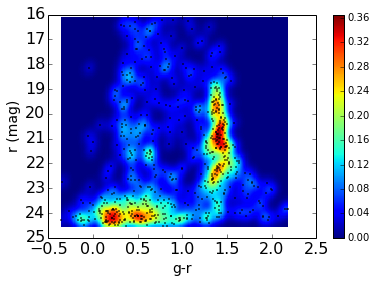

    use_ra = np.where((ra>134.8) & (ra<135.1))
    raZoom = ra[use_ra]
    decZoom = dec[use_ra]
    rZoom = r[use_ra]
    grZoom = gr[use_ra]
    use_dec = np.where((decZoom>=0.0) & (decZoom<=0.3))
    raZoom = raZoom[use_dec]
    decZoom = decZoom[use_dec]
    rZoom = rZoom[use_dec]
    grZoom = grZoom[use_dec]
    
    plt.figure(num=4)#, figsize=(10,10))
    plt.tick_params(labelsize=16) 
    #plt.title('$\chi^2_{red}$ map for $n$ and $q$')
    
    
    plt.xlabel('g-r', fontsize=14)
    plt.ylabel('r (mag)', fontsize=14)
    
    plt.ylim((25,16))
    #plt.plot(gr,r,'.k',ms=2)
    plt.plot(grZoom,rZoom,'.k',ms=2)
    #plt.plot(grF,rF,'.r',ms=1)
    
    
    
    ###############################################################
    
    nbins=200
    plt.figure(num=4)
    plt.tick_params(labelsize=16) 
    #plt.title('$\chi^2_{red}$ map for $n$ and $q$')
    
    plt.xlabel('g-r', fontsize=14)
    plt.ylabel('r (mag)', fontsize=14)
    
    #plt.xlim(-0.4,1.6)
    
    
    # Evaluate a gaussian kde on a regular grid of nbins x nbins over data extents
    gr_kde=np.reshape(grZoom,(len(grZoom),1))
    r_kde=np.reshape(rZoom,(len(rZoom),1))
    data=np.hstack((gr_kde,r_kde))
    
    
    k = kde.gaussian_kde(data.T,bw_method=0.1)  # 'scott' (default), 'silverman'
    xi, yi = np.mgrid[gr_kde.min():gr_kde.max():nbins*1j, r_kde.min():r_kde.max():nbins*1j]
    zi = k(np.vstack([xi.flatten(), yi.flatten()]))
    
    #plt.set_title('Gaussian KDE')
    plt.pcolormesh(xi, yi, zi.reshape(xi.shape))
    plt.colorbar()
    
    plt.show()

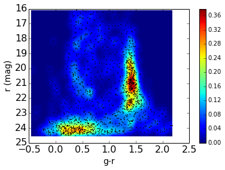

I think in this tile there is some kind of fragmented structure, and it seems
that it is spatially clustered according to type of stars:

The two blobs show turnoff point stars, while the central string shows a sparse
main sequence and this parallel string has a blob resembling a red clum or red
giant phase.

## Apparent magnitude histograms:

    plt.figure(num=9, figsize=(8,4))
    plt.tick_params(labelsize=16) 
    #plt.title('$\chi^2_{red}$ map for $n$ and $q$')
    
    plt.xlabel('r (mag)', fontsize=14)
    plt.ylabel('counts', fontsize=14)
    
    Nbins_r=20
    #plt.hist(rA,bins=Nbins_r,color='blue',label='nearMSTO, A1246')
    #plt.hist(rZ,bins=Nbins_r,color='green',alpha=0.85,label='nearMSTO, ZWCL1023')
    #plt.hist(rF,bins=Nbins_r,color='red',alpha=0.7,label='nearMSTO, A763')
    plt.hist(rMS,bins=frange(17.0,23.1,0.25),color='blue',label='nearMSTO')
    plt.hist(rRC,bins=frange(17.0,23.1,0.25),color='green',alpha=0.70,label='RC + K0-K2, MS')
    leg = plt.legend(fancybox=True, loc='upper left', ncol=1, fontsize=10, numpoints=1)  
    leg.get_frame().set_alpha(0.5)
    plt.show()

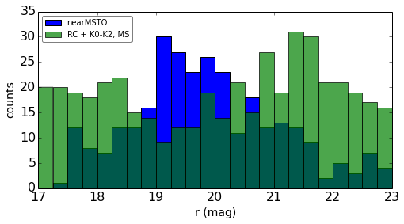

